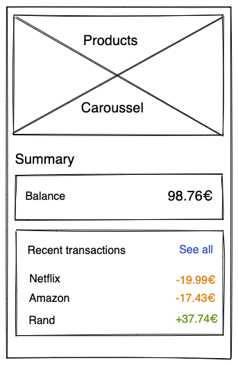
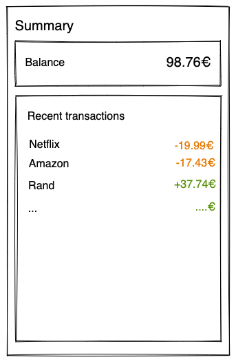

# React Native App Dashboard Challenge

## Overview
Create a React Native application that gives users a comprehensive dashboard by displaying their dynamically calculated account balance and a list of recent transactions.

## Requirements

### User Stories
- **Account Balance:** Users can view their calculated account balance.
- **Recent Transactions:** The dashboard shows the five most recent transactions.
- **Full Transaction History:** Users can tap the "See all" button to view their complete transaction list.

### API Endpoints
Fetch data from the following endpoints:
- **Products:** [https://628b46b07886bbbb37b46173.mockapi.io/api/v1/products](https://628b46b07886bbbb37b46173.mockapi.io/api/v1/products)
- **Transactions:** [https://628b46b07886bbbb37b46173.mockapi.io/api/v1/transactions](https://628b46b07886bbbb37b46173.mockapi.io/api/v1/transactions)

### Wireframes
Refer to the provided wireframes for guidance on layout and design:

| Dashboard | Transactions |
| --------- | :----------: |
|  |  |

## Nice-to-Have Features
- **Pull to Refresh:** Allow users to update the dashboard by pulling down on the list.
- **Offline Support:** Cache data locally for offline viewing.
- **Skeleton Loading Screens:** Display placeholders or spinners while data is loading.
- **Modal View for Transactions:** When a user taps on a transaction, display a modal with detailed information about that transaction.

## Challenge Instructions
- **Fork the repository.**
- **Build a clean, well-structured, and performant solution.**
- **Commit your work frequently.**
- **Submit your solution via a pull request.**

Happy coding!
